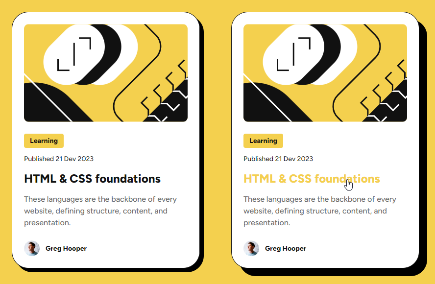

# Frontend Mentor - Blog preview card solution

This is a solution to the [Blog preview card challenge on Frontend Mentor](https://www.frontendmentor.io/challenges/blog-preview-card-ckPaj01IcS). Frontend Mentor challenges help you improve your coding skills by building realistic projects. 

## Table of contents

- [Overview](#overview)
  - [The challenge](#the-challenge)
  - [Screenshot](#screenshot)
  - [Links](#links)
- [My process](#my-process)
  - [Built with](#built-with)
  - [What I learned](#what-i-learned)
  - [Useful resources](#useful-resources)

## Overview

### The challenge

Users should be able to:

- See hover and focus states for all interactive elements on the page

### Screenshot

### Links

- Live site: <https://michahuhn.github.io/frontendmentor-blog-preview-card>
- Challenge solution: <https://www.frontendmentor.io/solutions/blog-preview-card-using-vue-LoGM08uVZp>

## My process

### Built with

- Vue
- SCSS
- Custom CSS properties
- Semantic HTML5 markup
- Flexbox
- Grid

### What I learned

I learned how to navigate through the Figma mockup.

I also learned how to create and animate a `box-shadow`.

### Useful resources

- [CSS border effects without using borders](https://www.youtube.com/watch?v=GI8t1ubXoX0) - How to create the card shadow.
- [Get your stylesheets more organized with Sass partials](https://www.youtube.com/watch?v=9Ld-aOKsEDk) - My SCSS folder structure is inspired by this video.
